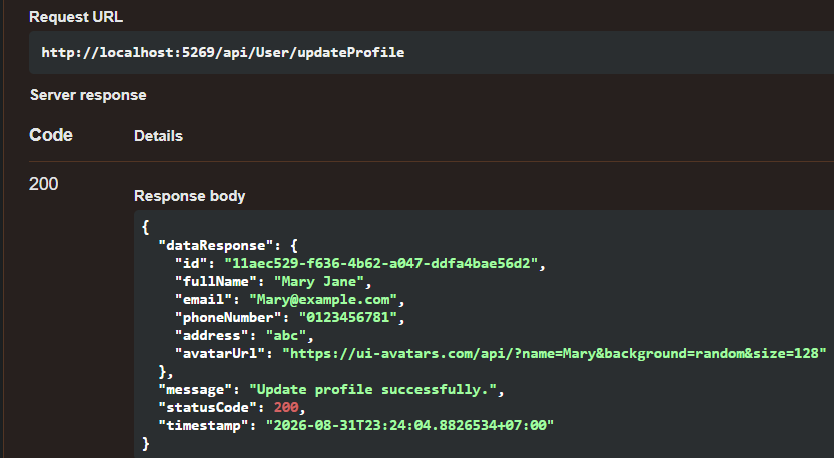
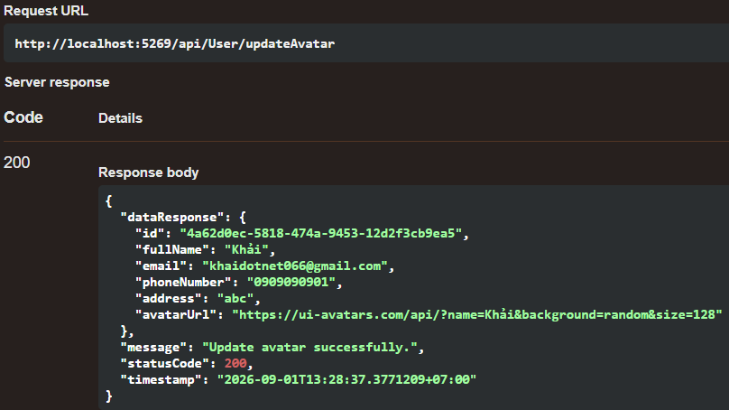
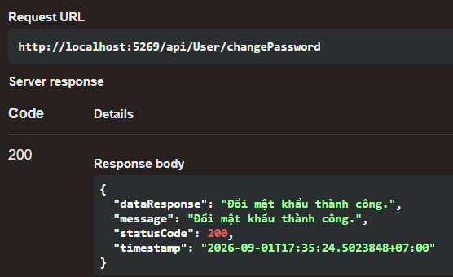
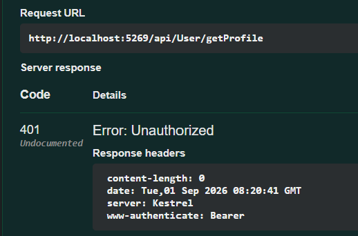
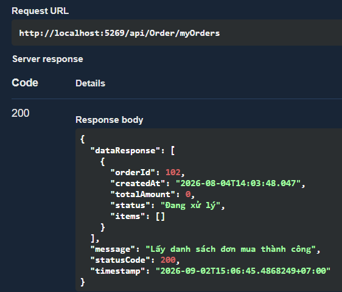

# CybersoftMarketPlace - Buổi 49 Profile Module

## Overview

Hoàn thành chức năng Profile cho dự án CybersoftMarketPlace (.NET 10 + Blazor).

Các chức năng đã thực hiện:

- Update Profile
- Update Avatar
- Change Password
- Logout
- Route Protection
- Order History

# Features Completed

## 1. Update Profile

Cho phép người dùng cập nhật thông tin cá nhân:

- Full Name
- Phone
- Address

API:

PUT /api/User/updateProfile

Screenshot:

## 2. Update Avatar

Cho phép người dùng cập nhật ảnh đại diện.

API:

PUT /api/User/updateAvatar

Screenshot:

## 3. Change Password

Người dùng có thể thay đổi mật khẩu.

DTO:

ChangePasswordDTO

Bao gồm:

- OldPassword
- NewPassword
- ConfirmPassword

API:

PUT /api/User/changePassword

Kiểm tra:

- Mật khẩu cũ phải chính xác
- Mật khẩu mới không được trùng mật khẩu cũ
- Confirm Password phải giống New Password

Screenshot:

## 4. Logout

Chức năng Logout thực hiện:

- Xóa JWT Token trong LocalStorage
- Clear User State
- Xóa Authorization Header

Screenshot:

## 5. Route Protection

Bảo vệ trang Profile khi người dùng chưa đăng nhập.

Flow:

User Logout

↓

Remove JWT Token

↓

Truy cập /profile

↓

Kiểm tra CurrentUser

↓

Redirect về Login

## 6. Order History

Người dùng có thể xem danh sách đơn hàng của chính mình.

API:

GET /api/Order/myOrders

Security:

UserId được lấy từ JWT Token.

Client không gửi UserId.

Xử lý Database:

- Include()
- ThenInclude()
- AsNoTracking()

Mục đích:

- Tránh lỗi N+1 Query
- Tối ưu truy vấn chỉ đọc

Screenshot:

# Architecture

Controller

↓

Service

↓

Unit Of Work

↓

Repository

↓

Database

# Technologies

Backend:

- ASP.NET Core Web API
- Entity Framework Core
- SQL Server
- JWT Authentication
- Repository Pattern
- Unit Of Work Pattern

Frontend:

- Blazor WebAssembly
- Bootstrap
- HttpClient
- LocalStorage

# API Endpoints

## User API

POST /api/User/Login

GET /api/User/getProfile

PUT /api/User/updateProfile

PUT /api/User/updateAvatar

PUT /api/User/changePassword

## Order API

GET /api/Order/myOrders

# Testing Completed

- Login successfully
- Get user profile
- Update profile
- Update avatar
- Change password
- Logout
- Block profile page after logout
- Get order history

# Screenshots

## Update Profile

## Update Avatar

## Change Password

## Logout

## Order History

